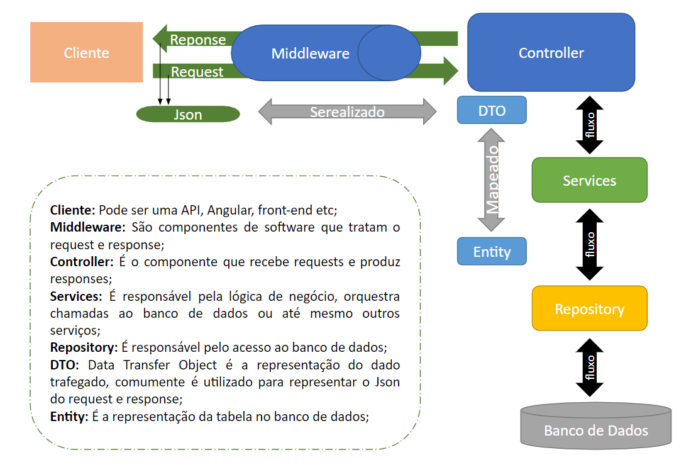

# MyApi CatalogoJogos

Live Code building an API base for a web application using ASP.NET Core web application from scratch with expert Thiago Campos de Oliveira by DIO (Digital Innovation One).

## Requeriments

[Visual Studio 2019](https://docs.microsoft.com/pt-br/visualstudio/releases/2019/compatibility) 

[.NET Core](https://dotnet.microsoft.com/download) Version 5.0

### Base model
